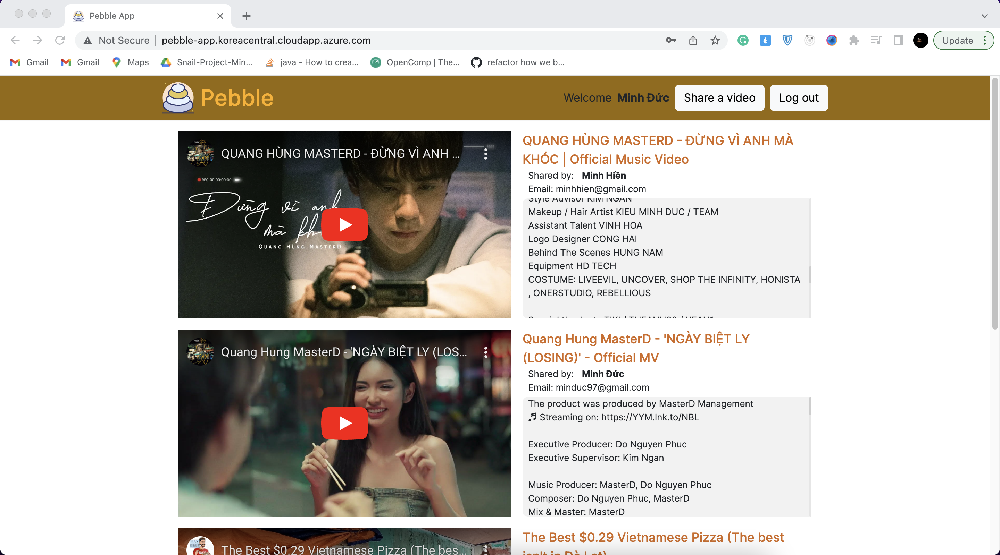
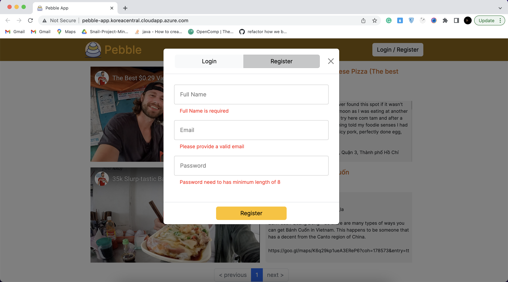
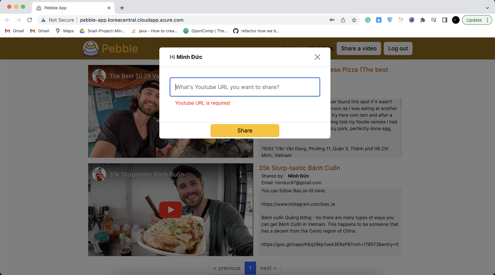

# Pebble - sharing video app

Taking a look at the demo here: http://pebble-app.koreacentral.cloudapp.azure.com/

## 1. Tech stack
- Rails 7
- React JS
- PostgreSQL

## 2. How to run app on local

### 1. Install Docker and Docker compose

If you already have docker and docker compose then please skip this part

```
curl -fsSL https://get.docker.com -o get-docker.sh
sh get-docker.sh
sudo curl -L "https://github.com/docker/compose/releases/download/1.29.2/docker-compose-$(uname -s)-$(uname -m)" -o /usr/local/bin/docker-compose
sudo chmod +x /usr/local/bin/docker-compose
```

### 2. Clone the project
```
git clone https://github.com/minhduc2803/Pebble.git
```
and also `cd` to the root of the project
```
cd Pebble
```

### 3. Add `.env` and .`env.frontend` file

You can copy what we have on `.env.example` and `.env.frontend.example`

```
cp .env.example .env
cp .env.frontend.example .env.frontend
```

### 4. Run docker-compose

```
docker-compose up --build -d
```

## 3. App features

### 1. Browsing videos

### 2. Login with validation / Keep login credential in `localStorage` / Logout

### 3. Register with validation

### 4. Share a video with validation


### 5. Instance notification when someone share a video
