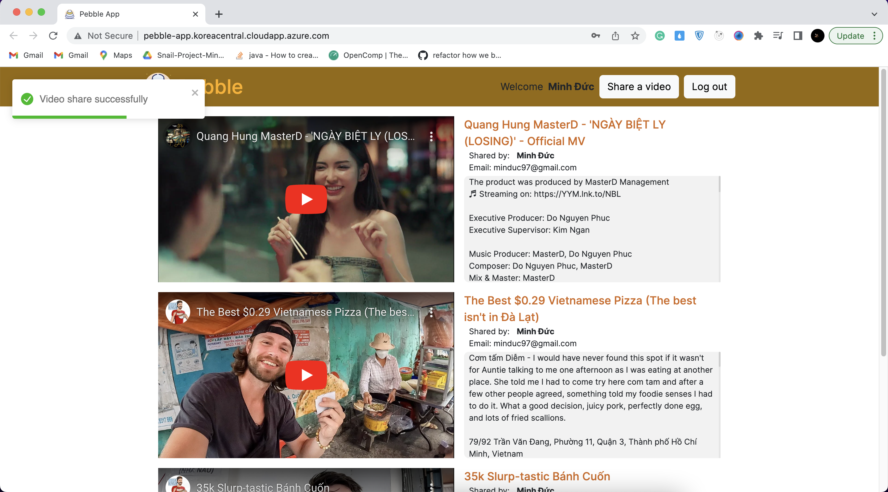

# Pebble - sharing video app

Taking a look at the demo here: <del>http://pebble-app.koreacentral.cloudapp.azure.com/</del> (I deleted the server, this link does not work anymore).

## 1. Tech stack
- Rails 7
- React JS 18
- PostgreSQL 14

## 2. How to run app on local

### 2.1. Install Docker and Docker compose

This part is for `Ubuntu` user only, if you are using Mac or Window please download Docker Desktop from https://www.docker.com/products/docker-desktop/

If you already have docker and docker compose then please skip this part

```
curl -fsSL https://get.docker.com -o get-docker.sh
sh get-docker.sh
sudo curl -L "https://github.com/docker/compose/releases/download/1.29.2/docker-compose-$(uname -s)-$(uname -m)" -o /usr/local/bin/docker-compose
sudo chmod +x /usr/local/bin/docker-compose
```
Add docker to docker group to run docker as non-root user
```
sudo groupadd docker
sudo usermod -aG docker $USER
newgrp docker
```

### 2.2. Clone the project
```
git clone https://github.com/minhduc2803/Pebble.git
```
and also `cd` to the root of the project
```
cd Pebble
```

### 2.3. Add `.env` and .`env.frontend` file

You can copy what we have on `.env.example` and `.env.frontend.example`

```
cp .env.example .env
cp .env.frontend.example .env.frontend
```

The `API_KEY` on `.env.example` and the `REACT_APP_API_KEY` on `.env.frontend.example` are both my public Youtube API key, you can change to use your own key.
You can follow [this tutorial](https://blog.hubspot.com/website/how-to-get-youtube-api-key) to create your own public API key.

### 2.4. Run docker-compose

```
docker-compose up --build -d
```

### 2.5. Run migration

If this is the first time you run the app on your machine then you need to run migration. Other wise please skip this part

```
docker-compose exec backend rails db:migrate
```

The app will available on `localhost:80`

## 3. Run tests suit

### 3.1 Front end
Navigate to `frontend` directory and run
```
yarn test
```
### 3.2 Back end
Navigate to `backend` directory and run
```
rspec
```

## 4. Deploy to Azure

- Create Ubuntu Azure virtual machine

- Create a public domain name for the machine

- In the Networking section, create `inbound port rule` to allow access to the machine from outside. Recommended adding at least 2 more rules
  - HTTP over port 80 to allow access to frontend server.
  - Any protocol over port 8000 to allow access to backend server api and websocket.
Please make sure to add "Any protocol over port 8000", other wise the websocket will not work.

- Connect with the machine via `ssh`

- Follow steps on section 2. to install Docker and Docker Compose on the machine, also pull the project to the machine.

- When adding `.env` remember to change the the `SERVER_HOST` to the machine public domain name. For example:
  ```
  SERVER_HOST=pebble-app.koreacentral.cloudapp.azure.com
  ```

- When adding `.env.frontend` remember to change the `REACT_APP_BACKEND_URL` to the machine public domain on port `8000`, and `REACT_APP_BACKEND_WEBSOCKET` to the machine public domain on port `8000` but with `ws` protocol:

  ```
  REACT_APP_BACKEND_URL=http://pebble-app.koreacentral.cloudapp.azure.com:8000
  REACT_APP_BACKEND_WEBSOCKET=ws://pebble-app.koreacentral.cloudapp.azure.com:8000/cable
  ```

- Run `docker-compose up --build -d` to run the server.

- If this is the first time deploy, please remember to run `migration` as well:
  ```
  docker-compose exec backend rails db:migrate
  ```

## 5. App features

### 5.1. Browsing videos with pagination

### 5.2. Login / Keep login credential in `localStorage`

### 5.3. Register

### 5.4. Share a video / validate if Youtube URL is real or not



### 5.5. Instant notification when someone shares a video


## 6. Troubleshooting

6.1. If the permission error arises when running Docker then you might running Docker as non-root user, please follow 2.1. above.

6.2 Please be carefull when deploying this app with Docker at the step of creating `.env` and `.env.frontend` files. The variables need to match the backend host and the link for websocket need to be in `ws:` protocol.

6.2 If you can access the frontend but api from backend return error and maybe you forgot to run `migration` or the variables on `.env` and `.env.frontend` are not valid.